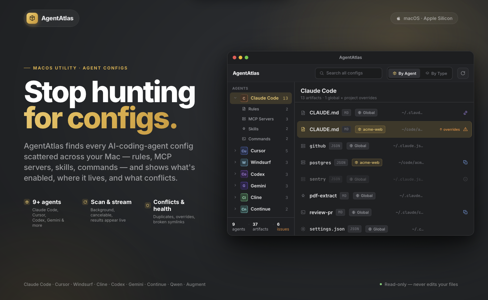

<p align="center">
  
</p>

# AgentAtlas

AgentAtlas is a native macOS app that finds every AI-coding-agent config scattered
across your Mac — rules, MCP servers, skills, commands, subagents and settings —
and shows what's enabled, where it lives, and what conflicts. One scan, one map.

No network, no telemetry — everything stays on your Mac.

## What it does

- **Scans your whole setup** — global locations (`~/.claude`, `~/.cursor`,
  `~/.codeium`, …) and every project folder, streaming results live as they're found.
- **Maps six categories** — Rules · MCP Servers · Skills · Commands · Subagents · Settings/Hooks.
- **Flags the mess** — duplicates across agents, project-over-global overrides,
  broken symlinks, parse errors and disabled entries.
- **Fixes it, safely** — enable a disabled server, remove a broken symlink, drop a
  duplicate. Every fix is reversible, with a backup and an undo history.

## Supported agents

Claude Code · Cursor · Windsurf · Cline · Codex · Gemini · Continue · Qwen · Augment
— plus generic `AGENTS.md`.

## Requirements

- macOS 26.5+
- Xcode — no third-party dependencies, pure AppKit

## Build & run

```bash
git clone https://github.com/vlr-code/AgentAtlas.git
cd AgentAtlas
open AgentAtlas.xcodeproj
```

Then run with ⌘R.

---

AgentAtlas 1.0
